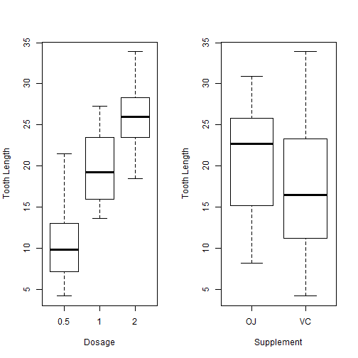

---
title       : Dosage, Treatment, Response
subtitle    : Pitch Deck for Outcome Analyzer
author      : Peter J Pih
job         : Final Project for Developing Data Products (devdataprod-031)
framework   : io2012        # {io2012, html5slides, shower, dzslides, ...}
highlighter : highlight.js  # {highlight.js, prettify, highlight}
hitheme     : tomorrow      # 
widgets     : []            # {mathjax, quiz, bootstrap}
mode        : selfcontained # {standalone, draft}
knit        : slidify::knit2slides

--- .class #id 

## Slide 2 - Introduction

<style>
strong {
  font-weight: bolder;
  font-size: 20
}
</style>

<strong>Outcome Analyzer</strong> is a clinical software graphical package which is helpful is determining the effectiveness of treatment supplements and corresponding dosage levels


--- .class #id 

## Slide 3 - Graphs

Using Outcome Analyzer, it is easy to see the effectiveness of treatments by dosage or supplement, or both


```r
par(mfrow = c(1, 3))  # 3 rows and 2 columns
# layout(matrix(c(1,1,2,3)), 1, 1, byrow=TRUE)
boxplot(len~dose, data=ToothGrowth, ylab="Tooth Length", xlab="Dosage")
boxplot(len~supp, data=ToothGrowth, ylab="Tooth Length", xlab="Supplement")
boxplot(len~supp*dose, data=ToothGrowth, ylab="Tooth Length", xlab="Supplement and Dosage")
```

 

--- .class #id 

## Slide 4 - Demo Software

A demonstration of the Outcome Analyzer can be run by following this link:
  
  
http://peterpih.github.io/09_DevelopingDataProductsFinal/My_Slidify/index
  
  
The demonstration software is a fully functioning


Outcome Analyzer is offered under the standard [Beerware](https://en.wikipedia.org/wiki/Beerware) license.

--- .class #id 

## Slide 5 - Appendix

Our demonstration of Outcome Analyzer uses the tooth growth dataset: **ToothGrowth** available in the R base dataset.

The dataset has 60 observations of tooth growth using supplements of either **Orange Juice** (30 observations) or **Vitamin C** (30 observations) at three different dosage levels: 0.5mg, 1.0mg, and 2.0mg (10 observations each).

'''{R}
summary(ToothGrowth)
```

